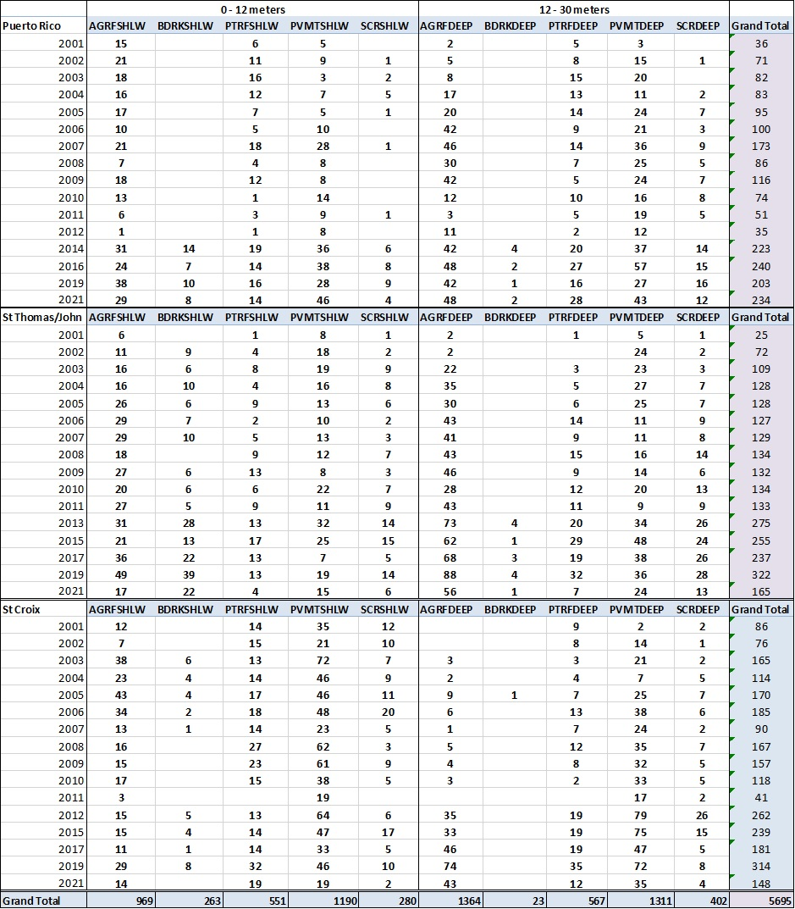
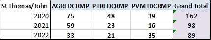
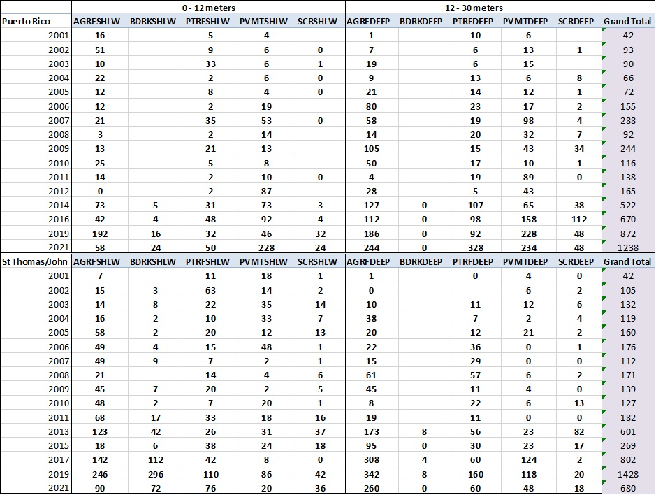
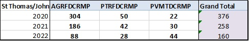
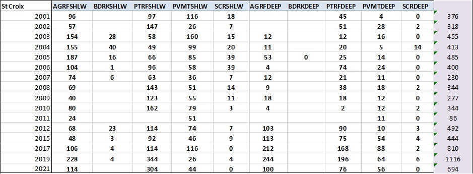

```{r setup, include=FALSE}
knitr::opts_chunk$set(warning = FALSE, message = FALSE)
# Needed Libraries
library(rvc)
library(tidyverse)
library(ggforce)

# Source Plotting Functions
source('../scripts/plot_time_series.R', local = knitr::knit_global())
source('../scripts/theme_publication.R', local = knitr::knit_global())

# Read in MIR data set
PRICO_TimeSeries_Calibrated <- readRDS("../input_datasets/prico_01_21_calibrated.rds")
STTSTJ_TimeSeries_Calibrated <- readRDS("../input_datasets/sttstj_01_21_calibrated.rds")
STX_TimeSeries_Calibrated <- readRDS("../input_datasets/stx_01_21_calibrated.rds")
```

# Sample Size by Island and Stratum

### 0 - 100ft



### 100 - 150ft



# Species {#Species .tabset}

## Yellowtail Snapper

### Yellowtail Raw Observations



### Yellowtail Raw Observations DCRMP



```{r echo=FALSE}
SEDAR_plot_domain_den_by_year(dataset = PRICO_TimeSeries_Calibrated,
                              species = "ocy chry",
                              title = "PRICO YT")

SEDAR_plot_domain_den_by_year(dataset = STTSTJ_TimeSeries_Calibrated,
                              species = "ocy chry",
                              title = "STTSTJ YT")
```

## Stoplight Parrotfish

### Stoplight Raw Observations



```{r echo=FALSE}
SEDAR_plot_domain_den_by_year(dataset = STX_TimeSeries_Calibrated,
                              species = "spa viri",
                              title = "STX SL")
```
